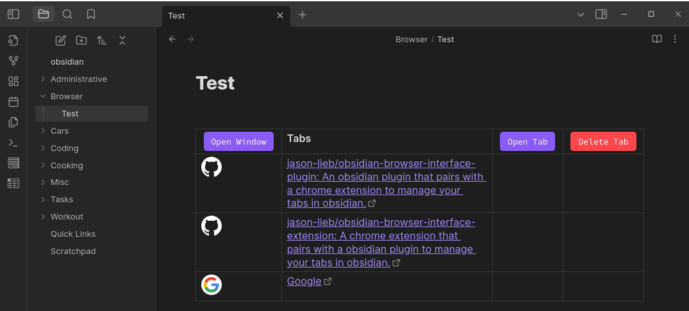

# Obsidian Browser Interface Plugin

An obsidian plugin that pairs with a [chrome extension](https://github.com/jason-lieb/obsidian-browser-interface-extension) to manage your tabs in obsidian.

This plugin displays the tabs saved from the chrome extension and creates buttons to reopen and delete tabs.

The Obsidian Browser Interface Plugin is dependent on the [Meta Bind plugin](https://github.com/mProjectsCode/obsidian-meta-bind-plugin). Also it is highly recommended to pair this plugin with the Advanced Tables plugin.

If there is interest in a firefox-supported extension, one might be created in the future.

### Installation

Until the obsidian plugin is approved, the only way to install it will be manually building it.

1. It is recommended to install the `obsidian-meta-bind-plugin` (link: [here](https://github.com/mProjectsCode/obsidian-meta-bind-plugin)) before installing this plugin.

2. Clone this repository to your local machine in your obsidian vault in the `.obsidian/plugins/` folder using `git clone https://github.com/jason-lieb/obsidian-browser-interface-plugin.git`.

3. Install the dependencies with `npm i`

4. Build the project with `npm run build`

5. Set up settings in obsidian.

### Limitations

This plugin currently only has the essential functions. The `Open Tab` and `Delete Tab` work by clicking on the row of the desired tab and then clicking the associated button. Also, the buttons don't work in reading mode from a limitation from obsidian.

### Screenshot

